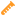

# LibreGame Template

Template for 2D and 3D Godot projects, built to be forked for bigger projects.

## Features

### Components
|  Class Name   | Icon |  Description  | Extends From |
| ------------- | :-------------: | -------------- | -------------- |
| ComponentBase ||Base class for all Components that exist outside of 2D or 3D space | Node |
| Component2D ||Base class for all Components that exist within 2D space | Node2D |
| Component3D ||Base class for all Components that exist within 3D space | Node3D |
| ResourceComponent ||Experimental component for creating and managing any type of singular resource | ComponentBase |

## Contributions
If you find any issues or bugs feel free to create an issue or a Pull Request.
